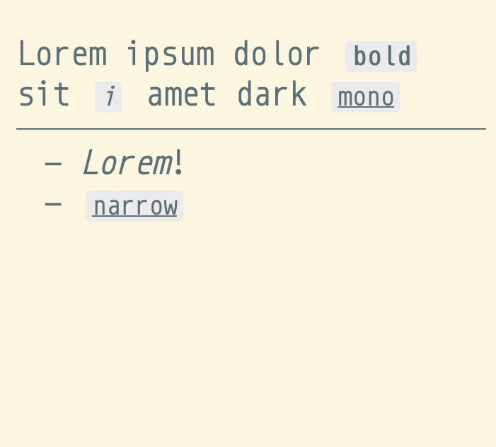

# Om

This is **Om**, a text "editor" inspired by [Plan9's Acme](https://en.wikipedia.org/wiki/Acme_(text_editor)).

 |

If you need a command, just write it.
Need to bold a piece of text? Just type **bold** or **b** and double-click on the word.
It will become your bold button.
---
Ideally this whole editor lives in a bookmark and a tab in your browser: nothing is stored remotely. Since I'm still adding some features this is still not available but can be tried directly [from Github Pages](https://mostlymaths.net/om/om.html). The inspiration for this was [here](https://mostlymaths.net/2020/10/202058-readings.html/#worlds-smallest-office-suitehttpszsergecompostsawfice).

### Rough areas
- Creating lists by writing a dash and a space in a new line works, but can behave somewhat weirdly.
- Font size and width are stored in pixels, which can be a pain if the window is resized (particularly width).
- Print preview looks bad, but when printing it actually works. It also prints the "buttons". I'm still unsure if I want to fix this.

### Planned features?
- Creating headings by typing hashes at the beginning of the line.
- Checkboxes.
- Code cleanup, there is a lot of repetition (particularly in how I handle and rewrite selection ranges).
- Inject the fonts so there is no need to pull the CSSs for mono and serif.

### The commands available (so far) are the following

| Command     | Description                                                                    |
|-------------|--------------------------------------------------------------------------------|
| mono        | Switch to a monospace font (Monoid) (stored in config)                         |
| serif       | Switch to a serif font (Reforma1969) (stored in config)                        |
| fontup      | Increase the document font by 2 pixels (stored in config)                      |
| fontdown    | Decrease the document font by 2 pixels (stored in config)                      |
| new         | Create a new document (erasing the current one)                                |
| print/🖨️    | Trigger the print dialog                                                       |
| dark        | Toggle dark/light mode (stored in config)                                      |
| save/💾     | Save the current changes and config in the URL, so it survives browser crashes |
| bold/b      | Bold the selected text                                                         |
| italic/i    | Italicize the selected text                                                    |
| underline/u | Underline the selected text                                                    |
| help        | Display help                                                                   |
| narrow      | Reduce the typing area width by 10% (stored in config)                         |
| widen       | Increase the typing area width by 10% (stored in config)                       |

### Name?

_Om_ is short for _Omni_. Acme (corp and the editor too) do many things. I'd like Om to do many too, but it is short of Omni.
